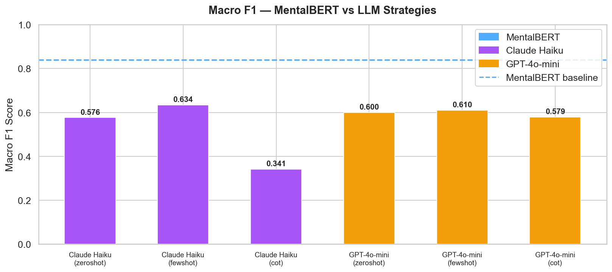

# MindScope AI — Mental Health NLP Classification & LLM Benchmark

## Overview
**MindScope AI** is an NLP-based system designed to detect and classify mental health conditions from text inputs.  
Using the *Sentiment Analysis for Mental Health* dataset from Hugging Face, it explores how linguistic cues reflect emotional and psychological states.

The project compared multiple modeling paradigms—**TF-IDF + SVM**, **Word2Vec + LSTM**, and **Fine-tuned Transformers (MentalBERT)**—to determine which approach most effectively captures nuanced mental health expressions.

## Model Comparison

- **TF-IDF + SVM**: Achieved a macro F1 score of **0.71**. This traditional approach offered solid baseline performance but struggled with minor classes and complex sentence structures due to a lack of contextual understanding.
- **Word2Vec + LSTM**: Attained a macro F1 score of **0.69**. While better at understanding sequence patterns, it encountered difficulties with nuanced emotions compared to transformer models.
- **MentalBERT (Winner)**: Outperformed both baseline models significantly, scoring a test accuracy of **84.2%** and a macro F1 score of **0.84**. This domain-adapted model perfectly matched infrequent targets like "Personality Disorder" and showed profound context awareness.

## Deployment

The successful **MentalBERT** model was deployed via a complete **Flask web application**. Users may now type sentences reflecting different emotional or psychological states into the frontend and get an accurate mental health tag returned in real-time.
The interface allows users to quickly test the model with natural language inputs while the backend processes the text using the trained MentalBERT classifier.

Web Application Interface:

Example of the MindScope AI web interface where users input text and receive mental health classification results.

In the example above, the user enters the sentence:

> "I just feel completely empty. I don't see the point in waking up anymore."

The **MentalBERT model** analyzes the text and classifies it as **Suicidal** with a **confidence score of 99.7%**.  
The interface displays the predicted label, the model’s confidence score, and a probability breakdown across all supported classes (*Suicidal, Personality Disorder, Stress, Bipolar, Normal, Depression, Anxiety*).

This visualization helps users quickly understand how the model interprets emotional cues in the input text.

> **Disclaimer:** This tool is for research and demonstration purposes only and does not replace professional medical advice.

---

## LLM Benchmark — Findings

To push the project further, MentalBERT was benchmarked against **Claude Haiku** and **GPT-4o-mini** across three prompt strategies (zero-shot, few-shot, chain-of-thought) on the same 251-row stratified test set used during training evaluation.

| Model | Strategy | Accuracy | Macro F1 | F1 — Personality Disorder |
|---|---|---|---|---|
| **MentalBERT (fine-tuned)** | — | **84.2%** | **0.838** | **0.830** |
| Claude Haiku | few-shot | 65.3% | 0.634 | 0.409 |
| GPT-4o-mini | few-shot | 63.3% | 0.610 | 0.375 |
| Claude Haiku | zero-shot | 59.8% | 0.576 | 0.263 |
| GPT-4o-mini | CoT | 59.4% | 0.579 | 0.293 |
| Claude Haiku | CoT | 41.0% | 0.341 | 0.000 |

**Key findings:**
- MentalBERT leads by **20 macro F1 points** over the best LLM strategy
- The gap is sharpest on **Personality Disorder** — MentalBERT 0.83 vs best LLM 0.41. General-purpose models struggle most on rare, clinically specific classes
- **Chain-of-thought backfired on Claude** — reasoning step-by-step dropped macro F1 from 0.576 to 0.341, showing CoT can hurt on subjective classification tasks
- GPT-4o-mini zero-shot costs **5× less** than Claude Haiku at comparable accuracy — a relevant cost trade-off for production use

Full per-class breakdown and visualizations are in [`llm_benchmark/evaluate.ipynb`](llm_benchmark/evaluate.ipynb).

---

## Why MentalBERT Outperformed Every Approach

Across all four paradigms tested — traditional ML, word embeddings, Claude, and GPT — MentalBERT consistently ranked first. The reason comes down to one concept: **domain adaptation**.

- **TF-IDF + SVM (F1: 0.71)** treats text as a bag of words with no understanding of order or meaning. It can separate broad categories but collapses on classes like Stress and Personality Disorder where the vocabulary overlaps heavily.

- **Word2Vec + LSTM (F1: 0.69)** learns word relationships and sequence patterns, but its embeddings were trained on general text (Google News), not mental health language. It captures sentence flow but misses domain-specific emotional nuance.

- **Claude Haiku & GPT-4o-mini (best F1: 0.634)** are powerful general reasoners trained on broad internet data. They perform well on obvious cases — Anxiety and Suicidal — but have never seen the specific linguistic patterns of Reddit mental health communities. Without fine-tuning, they cannot reliably distinguish Stress from Depression, or recognize the indirect language typical of Personality Disorder posts.

- **MentalBERT (F1: 0.838)** starts from BERT pre-trained specifically on mental health corpora, then is fine-tuned directly on this dataset's labeled examples. It has seen the exact style of language users express mental health states in, making it sensitive to subtle cues that general models miss entirely.

The takeaway: **domain-adapted fine-tuning beats prompt engineering**. For specialized, high-stakes classification tasks, a smaller model trained on the right data consistently outperforms a larger general model given only a prompt.

> **Disclaimer:** This tool is for research and demonstration purposes only and does not replace professional medical advice.
